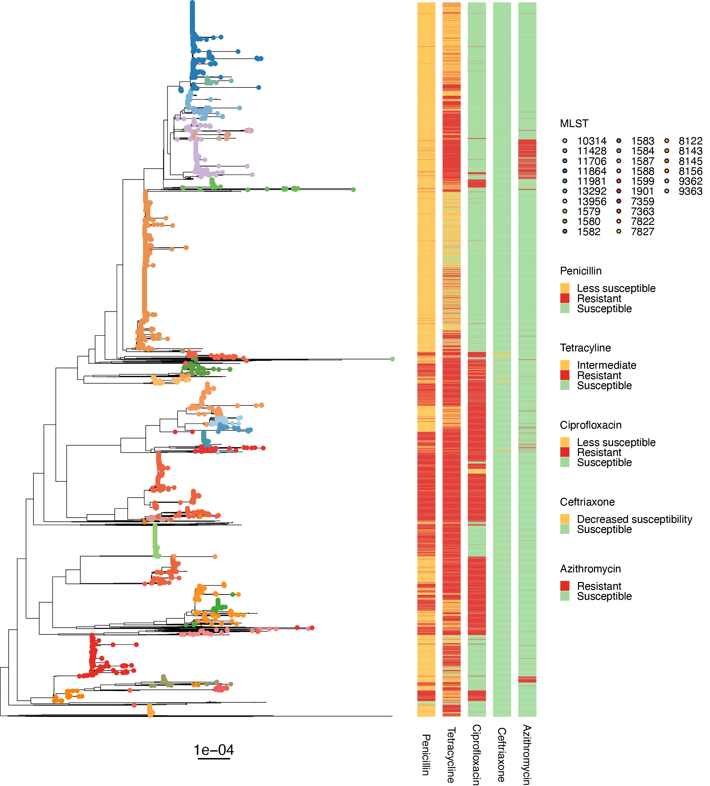
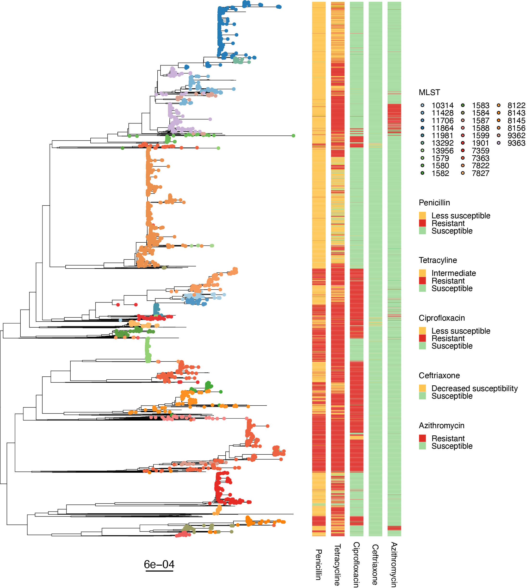

# Comparing cgMLST to SNP based approaches

The trimmed paired end reads were aligned to the NCCP11945 reference
genome using Snippy (v4.3.5), requiring a minimum of ten supporting
reads and a variant frequency of 0.9 or greater. Recombination filtering
was performed using Gubbins (v2.4.1) with default settings and the full
Snippy pseudoalignments as input. Following Gubbins, a core SNP
alignment was generated using snp-sites (v1) and the Gubbins filtered
alignment as input with the -c flag. The number of constant sites from
the whole genome pseudoalignment was also calculated using snp-sites
with the -C flag (v1). A ML phylogenetic tree was inferred using IQ-tree
(v2.0.3), with the best-fitting nucleotide substitution model chosen
based on the lowest BIC and the number of constant sites specified.
Molecular dating of ancestral events was performed using the
least-squares dating (LSD) software (v0.3), with the whole dataset
maximum likelihood phylogeny generated here used an input. All code is
here:

```         
snippy --cpus 8 --minfrac 0.9 --mincov 10 --ref NCCP11945.fa --cleanup --outdir snippy/AUSMDU00008753 --prefix AUSMDU00008753 --R1 /home/taouk/NGtransmission/reads/AUSMDU00008753_1.fq.gz --R2 /home/taouk/NGtransmission/reads/AUSMDU00008753_2.fq.gz

snippy-core snippy/* --ref NCCP11945.fa

run_gubbins.py --threads 10 core.full.aln

snp-sites -c -o core.full.Gubbins.SNPs.aln core.full.Gubbins.aln

snp-sites -C core.full.aln

iqtree -s core.full.Gubbins.SNPs.aln -B 1000 -T 60 -fconst 484258,580068,533403,495503

/home/taouk/lsd-0.3beta-master/src/lsd -d dates.tsv -i core_SNP.tree -c -r a
```

Using this method, the core SNP alignment consisted of 8,842 core sites
(polymorphic/variants that are present in all samples). While using a
core SNP alignment can be used to build a high-resolution phylogeny in
many cases and has been the gold standard approach in bacterial
phylogenetics for the past decade, when applied to a large and diverse
dataset as in this case, it results in a shrinking of informative sites,
and a less resolute phylogeny. N. gonorrhoeae is a very diverse species
with much recombination, therefor the number of sites conserved across
various samples is smaller. For example, across the full whole genome
pseudoalignment, there is a minimum of 6% N sites (134,866 bp) for any
genome. As these N sites will be dispersed mostly randomly across the
genome, the chances of any site having at least one N in at least one
sample is high and means that site will be excluded from the core SNP
alignment, even if it is informative to the phylogeny. One way to
increase the number of core SNP sites is to remove genomes with a high
proportion of N sites from the alignment and analysis. In this case,
1,184 genomes have more than 10% N sites. Excluding these would remove
20% of isolates from the phylogeny and clustering analysis – decreasing
our sampling proportion and introducing a high level of uncertainty into
our clustering. As a result, we opted to use a cgMLST method, a much
more permissive way of comparing relatedness across very diverse genomes
in a large dataset.

The concern that using a strict core results in isolates potentially
being classified as more closely related than they would be, stems from
the principle of using a static SNP threshold to define transmission.
For example, a common SNP threshold of 10 SNPs would result in much more
permissive clustering using a core SNP alignment of 8,842 compared to
using the same threshold on a larger core, as the threshold represents a
fraction of the total sites.

Regardless, we have generated a recombination filtered core genome SNP
ML phylogeny. We can see that the overall population structure is mostly
conserved, however the resolution at recent evolutionary events is much
reduced when compared to the concatenated cgMLST phylogeny.

## SNP tree



Population structure of 5,881 *N. gonorrhoeae* isolates included in this
study. The mid-point rooted maximum-likelihood tree (derived from 8,842
core SNP alignment) is plotted on the left. Tips are coloured by MLST
for MLST profiles which appear in at least 30 isolates. Phenotypic
resistance profiles are shown on the right. The tree scale represents
substitutions per site.

## cgMLST tree



Population structure of 5,881 *N. gonorrhoeae* isolates included in this
study. The mid-point rooted maximum-likelihood tree (derived from
concatenated cgMLST alignment) is plotted on the left. Tips are coloured
by MLST for MLST profiles which appear in at least 30 isolates.
Phenotypic resistance profiles are shown on the right. The tree scale
represents substitutions per site.

## Pairwise SNP distances

We calculated the pairwise SNP distances across the dataset from the
recombination filtered core SNP alignment using snp-dists (v1). The
median pairwise SNP distance between individuals was 122 (range 0 to
769), within individuals was 0 (range 0 to 211), within sites was 0
(range 0 to 0) and in paired couples was 0 (range 0 to 0). We find that
using a strict core SNP alignment of 8,842 sites, decreases the
resolution of relatedness between any isolates and decreases the utility
of our calibration isolates in determining a threshold, as the maximum
pairwise SNP distance is 0. The methods are as follows:

### Libraries and load data:

FILES LINK

```         
# Libraries
library(tidyverse)
library(ggplot2)
library(RColorBrewer)

SNP_matrix <- as.matrix(read.csv("6215_core_dists.txt", sep = "\t", row.names = 1))

intrapatient <- read.csv("intrapatient.csv")

unique <- read.csv("unique.csv")
```

### Set up matrix, melt, merge and add columns:

```         
# melt matrix keeping only top of pyramid
SNP_melt = data.frame(ID1=rownames(SNP_matrix)[row(SNP_matrix)[upper.tri(SNP_matrix)]], ID2=colnames(SNP_matrix)[col(SNP_matrix)[upper.tri(SNP_matrix)]], dist=SNP_matrix[upper.tri(SNP_matrix)])

# Merge SNP_melt with dataframe that tells us which IDs are the callibration isolates (~5 mins)
SNP_melt = SNP_melt %>% merge(intrapatient, by.x = "ID1", by.y = "AUSMDU", all.x = F, all.y = F) %>% merge(intrapatient, by.x = "ID2", by.y = "AUSMDU", all.x = F, all.y = F)

# Check for NAs
sum(is.na(SNP_melt))

# Create a new column called "check" that indicates whether the Patient_no.x and Patient_no.y columns are the same or different
SNP_melt$check = ifelse(SNP_melt$Patient_no.x == SNP_melt$Patient_no.y, "same", "diff")
```

### Make dataframes for between individual, within individuals, within site and pairs:

```         
between_patients = filter(SNP_melt, SNP_melt$check == "diff")
between_patients$legend = "Between individuals"
between_patients = data.frame(between_patients$dist, between_patients$legend)
colnames(between_patients)[1] <- "dist"
colnames(between_patients)[2] <- "legend"

within_patients = filter(SNP_melt, SNP_melt$check == "same")
within_patients = filter(within_patients, within_patients$Cat.y == "WIthin-patient")
within_patients$legend = "Within individuals"
within_patients = data.frame(within_patients$dist, within_patients$legend)
colnames(within_patients)[1] <- "dist"
colnames(within_patients)[2] <- "legend"

within_site = filter(SNP_melt, SNP_melt$check == "same")
within_site = filter(within_site, within_site$Cat.x == "Within-site")
within_site$legend = "Within site"
within_site = data.frame(within_site$dist, within_site$legend)
colnames(within_site)[1] <- "dist"
colnames(within_site)[2] <- "legend"

dist = c(SNP_matrix["AUSMDU00054152","AUSMDU00054265"], 
         SNP_matrix["AUSMDU00056203","AUSMDU00056226"],
         SNP_matrix["AUSMDU00058007","AUSMDU00058008"],
         SNP_matrix["AUSMDU00058728","AUSMDU00058842"],
         SNP_matrix["AUSMDU00059133","AUSMDU00059135"],
         SNP_matrix["AUSMDU00059905","AUSMDU00059919"],
         SNP_matrix["AUSMDU00060670","AUSMDU00060683"],
         SNP_matrix["AUSMDU00061345","AUSMDU00061360"],
         SNP_matrix["AUSMDU00064875","AUSMDU00064881"])
legend = c("Paired")
Pairs = data.frame(dist, legend)

data_merged = rbind(between_patients, within_patients, within_site, Pairs)
data_merged_within = rbind(within_patients, within_site, Pairs)
```

### Print median and range:

```         
min(between_patients$dist)
max(between_patients$dist)
median(between_patients$dist)

min(within_patients$dist)
max(within_patients$dist)
median(within_patients$dist)

min(within_site$dist)
max(within_site$dist)
median(within_site$dist)

min(Pairs$dist)
max(Pairs$dist)
median(Pairs$dist)
```

The median pairwise SNP distance between individuals was 122 (range 0 to
769), within individuals was 0 (range 0 to 211), within sites was 0
(range 0 to 0) and in paired couples was 0 (range 0 to 0).

### Descriptive plots:

```         
ggplot(data_merged, aes(x=dist, fill = factor(legend, level = c("Between individuals", "Within individuals", "Within site", "Paired")))) +
  geom_histogram(binwidth = 1) +
  theme_bw() +
  theme(axis.text.x = element_text(size = 8, angle = 45, hjust = 1),
        legend.position = "none",
        panel.background = element_rect(color = "black", size = 1),
        strip.text.y = element_text(size = 8),
        strip.background = element_rect(color="black", size = 1),
        legend.title = element_text(size=8)) +
  ylab("") +
  xlab("Pairwise SNP distance") +
  scale_y_continuous(labels = function(x) format(x, scientific = FALSE, big.mark = " ")) +
  ggtitle("") +
  facet_grid(scales = "free", rows = vars(factor(legend, level = c("Between individuals", "Within individuals", "Within site", "Paired"))))
```

another one

```         
ggplot(data_merged, aes(x=dist, fill = factor(legend, level = c("Between individuals", "Within individuals", "Within site", "Paired")))) +
  geom_histogram(binwidth = 1) +
  theme_bw() +
  theme(axis.text.x = element_text(size = 8, angle = 45, hjust = 1),
        legend.position = "none",
        panel.background = element_rect(color = "black", size = 1),
        strip.text.y = element_text(size = 8),
        strip.background = element_rect(color="black", size = 1),
        legend.title = element_text(size=8)) +
  ylab("") +
  xlab("Pairwise SNP distance") +
  scale_y_continuous(labels = function(x) format(x, scientific = FALSE, big.mark = " ")) +
  ggtitle("") +
  facet_grid(scales = "free", rows = vars(factor(legend, level = c("Between individuals", "Within individuals", "Within site", "Paired")))) +
  scale_x_continuous(limits = c(-1, 10))
```
